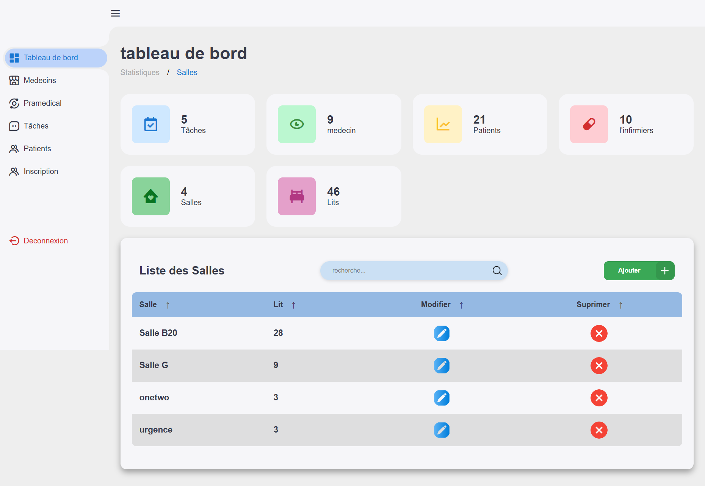
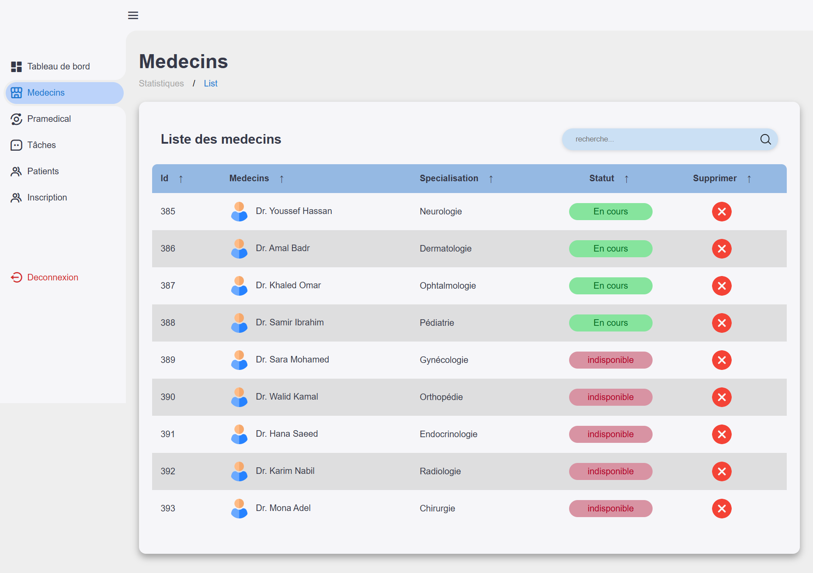
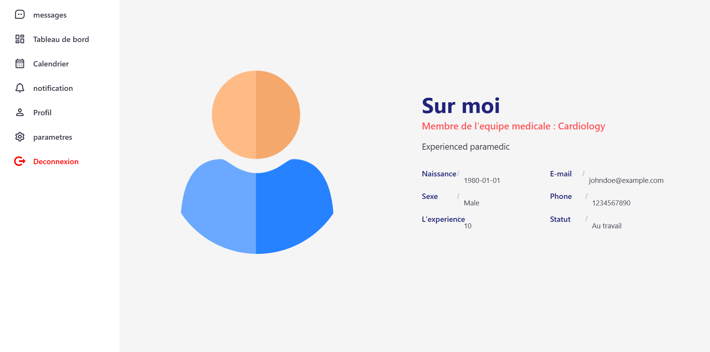
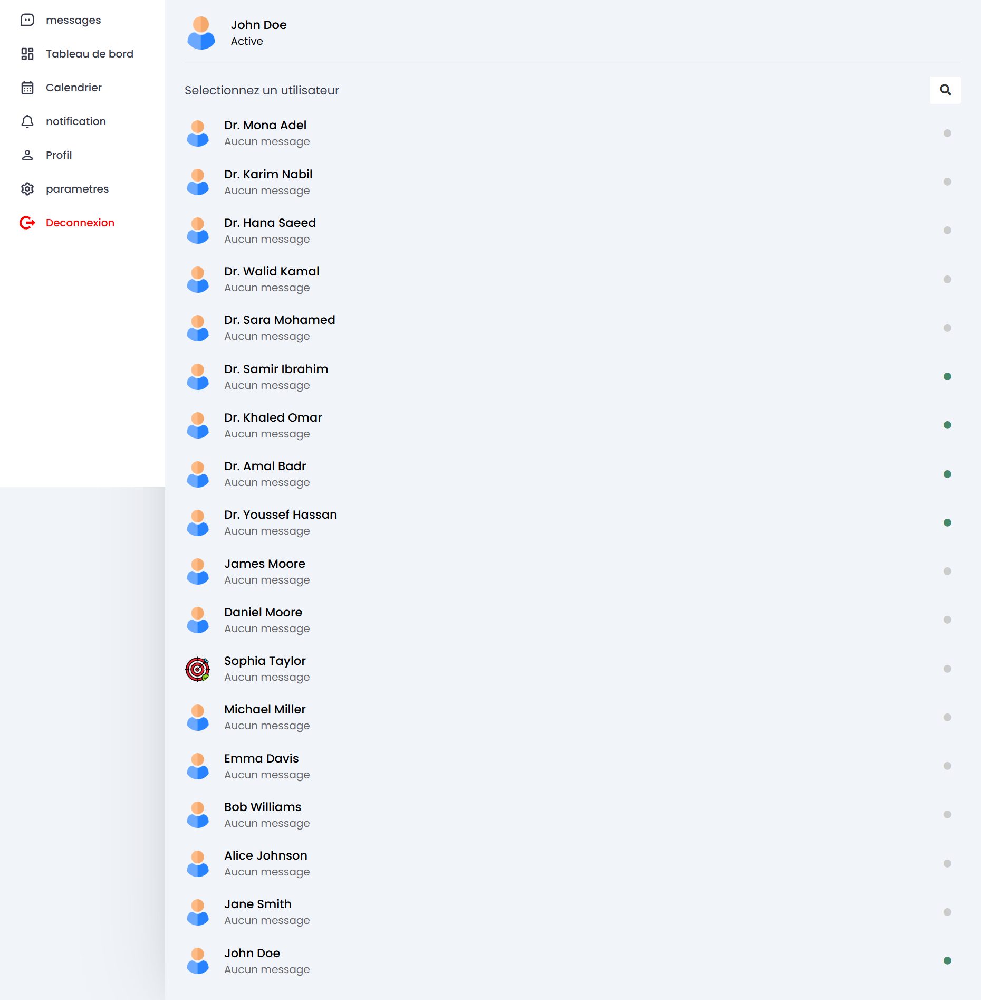

# 🏥 MediTask - Smart Task & Attendance Management for Healthcare  

A web-based **task and attendance management system** designed for **doctors, paramedical teams, and administration** to enhance **workflow, communication, and patient care** in medical institutions.  

---

## 🚀 Features  

### 🏛 **Administration Panel**  
✅ Assign tasks to doctors and paramedical staff.  
✅ Manage hospital **beds, rooms, and patient records**.  
✅ Approve or reject **registration requests**.  
✅ Monitor **statistics and hospital performance**.  

### 🩺 **Doctors**  
✅ **Chat** with colleagues and paramedical teams.  
✅ **Manage profile** and update personal information.  
✅ **View and complete assigned tasks**.  
✅ **Send tasks** to paramedical staff.  

### 👨‍⚕️ **Paramedical Teams**  
✅ **Chat** with doctors and other staff members.  
✅ **Manage profile** and edit details.  
✅ **View and validate assigned tasks**.  

### 📌 **Smart Task Assignment System**  
✅ Tasks are **automatically assigned** to available doctors or paramedical teams.  
✅ If no free paramedical staff or beds are available, tasks are sent to **the doctor with the least number of tasks**.  

### 💬 **Real-Time Communication**  
✅ **Instant chat** between users (Doctors, Paramedical, and Admins).  

### ⏳ **Attendance & Work Monitoring**  
✅ Track **working hours, presence, and attendance** of staff.  

---

## 🛠 Tech Stack  

- **Frontend:** React.js / Next.js  
- **Backend:** Django / Node.js (Express)  
- **Database:** PostgreSQL / MongoDB  
- **Real-Time Communication:** WebSockets / Firebase  
- **Authentication:** JWT / OAuth  
- **Styling:** Tailwind CSS / Bootstrap  

---

## 📷 Screenshots  

  
  
  
  

---

## *admin profile*
username : admin
password : admin
